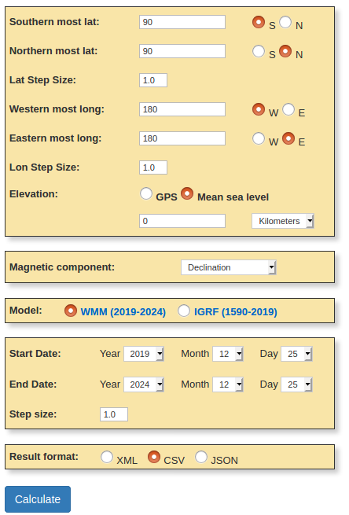

# magdec
Compute Magnetic Compass Declination angle given a latitude and longitude

# Overview
The World Magnetic Model is the standard model used by the
U.S. Department of Defense, the U.K. Ministry of Defence, the North
Atlantic Treaty Organization (NATO) and the International Hydrographic
Organization (IHO), for navigation, attitude and heading referencing
systems using the geomagnetic field present on the planet Earth. It is
also used widely in civilian navigation and heading systems. The
model, associated software, and documentation are distributed by NCEI
on behalf of NGA. The model is produced at 5-year intervals, with the
current model expiring on December 31, 2019.

This module provides a mini magnetic declination corrector suitable
for embedded systems which may need to provide accurate magnetometer
readings and may not necessarily have Internet connectivity.

# Theory of operation

The task is to extract declination angles based on provided latitude &
longitude readings of the local device from the matching entry in the
table. The development consists of a script which parses a table
generated from the online NOAA Magnetic field calculator, and builds a
C table and structure. We then have a small test harness which
performs a simple linear lookup to retrieve the declination angle for
various positions. As the table can be a subset or all of the world, 
portions or all of the table may be included in your application.

Once the declination angle is computed for your position, this angle
may be added to your compass bearing calculations so as to provide
true magnetic north and corrected bearings for any location on the
globe.

Depending on your application, you can embed all or a portion of your
table data either on the device or provide a means for external
retrieval or firmware update.

# Usage 

The WMM model uses a grid approach for the data and provides CSV
output which may be easily parsed in a Perl script as below.  

To use the model, go here and input your coords
http://www.ngdc.noaa.gov/geomag-web/#igrfgrid

For Continental North America, Greenland, tip of South America

Lat: Min=11, Max=73
Lon: Min=169, Max=23
Declination
CSV Output
WMM 2014-2019

(Pick a start/end date)

Export the CSV file and save it (e.g. igrfgridData.csv)

For the whole planet Earth:

 
Lat: Min = 90S, Max = 90 N
Lon: Min = 180W, Max = 180E
Elevation - Mean Sea Level
Declination
CSV Output
WMM 2014-2019

Here is an example of input below:

Export the CSV file and save it (e.g. igrfgridData.csv) (press Calculate above)

Run the below:

./parse_mag_dec.pl igrfgridData.csv 

Insert the resulting table output below into your code. See magdec.c for an example of how to use the data and see earth.c for the full WMM table data (earth2020.c for latest WMM2020 model).

