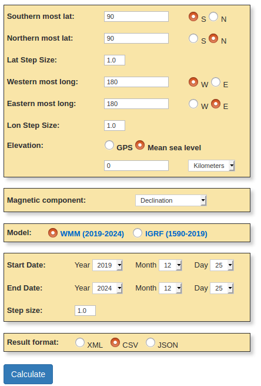

# magdec
Compute Magnetic Compass Declination angle given a latitude and longitude

# Overview
The World Magnetic Model is the standard model used by the
U.S. Department of Defense, the U.K. Ministry of Defence, the North
Atlantic Treaty Organization (NATO) and the International Hydrographic
Organization (IHO), for navigation, attitude and heading referencing
systems using the geomagnetic field present on the planet Earth. It is
also used widely in civilian navigation and heading systems. The
model, associated software, and documentation are distributed by NCEI
on behalf of NGA. The model is produced at 5-year intervals,
with the current model expiring on December 31, 2029.

This project provides two approaches to magnetic declination correction
suitable for embedded systems without Internet connectivity:

| Module | Model | Method | Accuracy | ROM | RAM |
|--------|-------|--------|----------|-----|-----|
| **magdec** | WMM2025 (earth2026.c) | Table lookup | ~1 degree (depends on grid resolution) | ~1 MB | ~100 bytes |
| **magdec2** | WMM2025 | Spherical harmonic computation | Full WMM accuracy (~0.3 degrees) | ~6 KB | ~4 KB stack |

# magdec2 -- WMM-2025 Spherical Harmonic Calculator

## Overview

`magdec2` is a clean-room C99 implementation of the WMM-2025 magnetic
declination calculator.  It computes declination using the full
degree-12 spherical harmonic expansion -- the same math as the official
NOAA/NCEI library -- but in a single self-contained function with no
dynamic memory allocation.

The WMM2025 Gauss coefficients (epoch 2025.0, valid 2025-2030) are
embedded directly in `wmmcof2025.c` as C arrays, eliminating any need
to read the COF file at runtime.

### Validated

All six NOAA WMM2025 surface test values match exactly:

| Location | Year | NOAA Reference | magdec2 |
|---|---|---|---|
| 80N, 0E | 2025.0 | +1.28 degrees | +1.28 degrees |
| 0N, 120E | 2025.0 | -0.16 degrees | -0.16 degrees |
| 80S, 240E | 2025.0 | +68.78 degrees | +68.78 degrees |
| 80N, 0E | 2027.5 | +2.59 degrees | +2.59 degrees |
| 0N, 120E | 2027.5 | -0.24 degrees | -0.24 degrees |
| 80S, 240E | 2027.5 | +68.49 degrees | +68.49 degrees |

## Building

Requires GCC (various cross-compilers, under WSL on Windows, native Linux, or any POSIX system with `-lm`).

```bash
make magdec2
```

Or build both modules:

```bash
make all
```

## Usage

```
magdec2 <lat> <lon> [decimal_year]
```

- `lat`, `lon` -- decimal degrees (+N/-S, +E/-W)
- `decimal_year` -- optional, defaults to current date
- Epoch 2025.0, valid 2025.0-2030.0

### Examples

```bash
$ ./magdec2 40.7128 -74.0059
-12.63 degrees (W)  at (+40.7128, -74.0059) in 2026.20

$ ./magdec2 39.7392 -104.9903 2025.0
+7.64 degrees (E)  at (+39.7392, -104.9903) in 2025.00
```

### Test script

Run all 13 GPS test locations (from the original magdec test harness):

```bash
./test_magdec2.sh           # defaults to epoch 2025.0
./test_magdec2.sh 2027.5    # test with specific year
```

## Files

| File | Description |
|------|-------------|
| `magdec2.c` | Spherical harmonic computation + CLI |
| `wmmcof2025.c` | WMM2025 Gauss coefficients (gnm, hnm, dg/dt, dh/dt) |
| `test_magdec2.sh` | Test script -- 13 locations from test.c |
| `Makefile` | Build targets: `magdec`, `magdec2`, `all`, `clean` |

## Algorithm

1. **Time-adjust coefficients** -- linear secular variation from epoch:
   `g(t) = g(2025) + dg/dt x (t - 2025.0)`
2. **Geodetic -> geocentric** -- WGS-84 ellipsoid coordinate transform
3. **Associated Legendre functions** -- Gauss-normalized recursion,
   then converted to Schmidt quasi-normalized with sign flip
   (colatitude -> latitude derivative)
4. **Spherical harmonic summation** -- degree 1-12, order 0-n,
   90 coefficient pairs, yielding Bx (north), By (east), Bz (down)
   in the geocentric spherical frame
5. **Rotate to geodetic** -- correct for geocentric/geodetic latitude
   difference (Eq. 16, WMM Technical Report)
6. **Declination** -- `atan2(By, Bx)` in degrees

## Embedded Systems Integration

`magdec2` is designed for direct integration into embedded firmware.
The core function `wmm_declination()` is pure computation with no
heap allocation, no file I/O, and no OS dependencies beyond `<math.h>`.

### API

```c
/* Returns magnetic declination in degrees (+E / -W) */
double wmm_declination(double lat_deg, double lon_deg, double decimal_year);
```

To integrate: add `magdec2.c` and `wmmcof2025.c` to your firmware
build. Remove the `main()` function (or guard it with `#ifndef`), and
call `wmm_declination()` directly.  The only external dependency is
the math library (`sin`, `cos`, `asin`, `atan2`, `sqrt`).

### Resource Usage

**ROM / Flash** (~6 KB total):

| Component | Size |
|-----------|------|
| `wmm_declination()` code | 2,561 bytes |
| Coefficient arrays (4 x 91 doubles) | 2,912 bytes |
| String literals / overhead | ~500 bytes |

**RAM / Stack** (~4.1 KB, all on stack, no heap):

| Array | Elements | Size |
|-------|----------|------|
| `g[91]`, `h[91]` (time-adjusted coefficients) | 182 doubles | 1,456 bytes |
| `Pcup[91]`, `dPcup[91]` (Legendre functions) | 182 doubles | 1,456 bytes |
| `sqn[91]` (normalization ratios) | 91 doubles | 728 bytes |
| `rr[13]`, `cos_ml[13]`, `sin_ml[13]` | 39 doubles | 312 bytes |
| Scalar locals | ~20 doubles | 160 bytes |

**CPU** (~1,500 floating-point operations + 80 sqrts + 6 transcendentals):

| Platform | Clock | FPU | Time |
|----------|-------|-----|------|
| x86-64 / ARM Cortex-A | 1+ GHz | Hardware double | < 10 us (est.) |
| ARM Cortex-M7 | 400 MHz | Hardware double | 20-50 us (est.) |
| ARM Cortex-M4F (Renesas RA4M1) | 75 MHz | Hardware float only | **10.2 ms (measured)** |
| ARM Cortex-M4F | 168 MHz | Hardware float only | 0.3-1 ms (est.) |
| ARM Cortex-M4F (float port) | 168 MHz | Hardware float | 20-50 us (est.) |
| ARM Cortex-M0/M0+ | 48 MHz | None | 5-20 ms (est.) |

### Single-Precision Float Port

The code uses `double` throughout for maximum accuracy.  For Cortex-M4F
targets with only single-precision FPU hardware, change `double` to
`float` and `sqrt`/`sin`/`cos`/etc. to `sqrtf`/`sinf`/`cosf`.  The
WMM model itself is accurate to ~0.3 degrees at mid-latitudes, so 7 significant
digits (`float`) is more than adequate.  This reduces stack usage to
~2 KB and enables hardware FPU acceleration.

### Decimal Year

On systems without `time()` / `gmtime()`, compute the decimal year from
your GPS time or RTC:

```c
double dyear = year + (day_of_year / 365.25);
double decl = wmm_declination(gps_lat, gps_lon, dyear);
```

### Arduino Sketch

The provided sketch performs the magdec2 calculation using the same test coordinates
as is done in test.c for the lookup table version. Its an implementation that will
save you space on a small embedded system. For basic testing, the sketch was compiled
and verified on an [Arduino Uno R4 Minima](https://docs.arduino.cc/hardware/uno-r4-minima/)
(75 Mhz ARM Cortex M4F - Renesas RA4M1 with 32K SRAM, 256KB of FLASH). Code info:

Sketch uses 55096 bytes (21%) of program storage space. Maximum is 262144 bytes.
Global variables use 4264 bytes (13%) of dynamic memory, leaving 28504 bytes for local variables. Maximum is 32768 bytes.

Average compute time for wmm_declination is about 10253 usecs (10.2ms) on the Uno R4 Minima


### Compass Correction

Once you have the declination, correct your magnetometer heading:

```c
true_heading = magnetic_heading + declination;
```

Where `declination > 0` means magnetic north is east of true north.
The mnemonic: **"East is least, West is best"** -- subtract east
declination, add west declination (equivalently, just add the signed
value since east is positive and west is negative).

---

# magdec -- Table Lookup (WMM2025)

## Theory of operation

The task is to extract declination angles based on provided latitude &
longitude readings of the local device from the matching entry in the
table. The development consists of a script which parses a table
generated from the online NOAA Magnetic field calculator, and builds a
C table and structure. We then have a small test harness which
performs a simple linear lookup to retrieve the declination angle for
various positions. As the table can be a subset or all of the world,
portions or all of the table may be included in your application.

Once the declination angle is computed for your position, this angle
may be added to your compass bearing calculations so as to provide
true magnetic north and corrected bearings for any location on the
globe.

Depending on your application, you can embed all or a portion of your
table data either on the device or provide a means for external
retrieval or firmware update.

## Usage

The WMM model uses a grid approach for the data and provides CSV
output which may be easily parsed in a Perl script as below.

To use the model, go here and input your coords
http://www.ngdc.noaa.gov/geomag-web/#igrfgrid

For Continental North America, Greenland, tip of South America

Lat: Min=11, Max=73
Lon: Min=169, Max=23
Declination
CSV Output
WMM 2014-2019

(Pick a start/end date)

Export the CSV file and save it (e.g. igrfgridData.csv)

For the whole planet Earth:


Lat: Min = 90S, Max = 90 N
Lon: Min = 180W, Max = 180E
Elevation - Mean Sea Level
Declination
CSV Output
WMM 2014-2019

Here is an example of input below:



Export the CSV file and save it (e.g. igrfgridData.csv) (press Calculate above)


Run the below:

./parse_mag_dec.pl igrfgridData.csv

Insert the resulting table output below into your code. See magdec.c for an example of how to use the data and see earth2026.c for the current WMM2025 table data (2026-2029).
